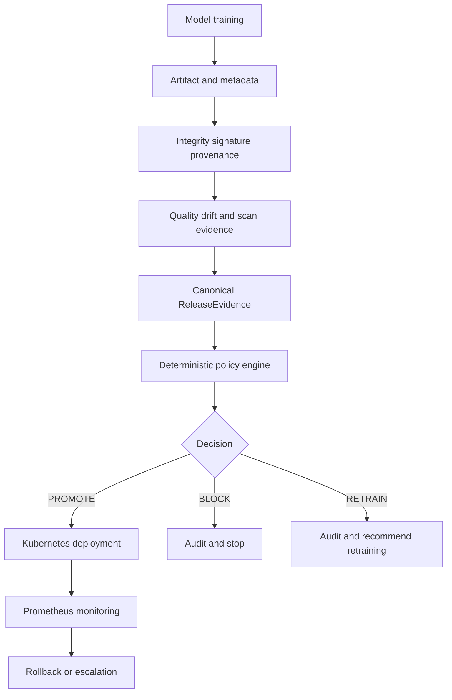

# ModelShield

ModelShield is a policy-driven ML release control plane. It evaluates model quality, data drift, artifact integrity, provenance, and supply-chain security before a model can be promoted to Kubernetes. It also exposes runtime metrics and supports controlled rollback.

## Product promise

> No ML model reaches deployment unless its quality, security, provenance, and deployment policies pass.

The deterministic policy engine is the final authority. Future AI release intelligence may investigate evidence and explain decisions, but it will never approve, deploy, override policy, or change access controls.

## Project status

| Stage | Status | Evidence |
|---|---|---|
| Phase 0: foundation | Complete | Repository verifier, architecture, lifecycle, and threat model |
| Phase 1: V1 golden path | Complete | Reproducible release command and `52` passing tests |
| Phase 1.5: platform improvements | Complete | MLflow, Terraform, Grafana, SBOM, Conftest, and Scorecard integrations |
| Phase 2: release intelligence | Started | Read-only, deterministic, schema-validated investigator contract |

## Golden path

```text
Train model
  -> persist artifact and metadata
  -> calculate and verify SHA-256
  -> verify Ed25519 signature and provenance
  -> evaluate quality and PSI drift
  -> consume dependency and container scan results
  -> build ReleaseEvidence
  -> apply deterministic policy
  -> PROMOTE, BLOCK, or RETRAIN
  -> append complete audit record
```

Run it with one cross-platform command:

```bash
python scripts/release.py --model-version v1
```

Exit codes are deterministic:

- `0`: `PROMOTE`
- `1`: `BLOCK`
- `2`: `RETRAIN` recommended; never deployed automatically

The command uses the built-in scikit-learn breast-cancer dataset, a seeded train/test split, a scaled logistic-regression pipeline, generated clean scan reports, and the configured model policy. It writes the model artifact, signed metadata, and JSONL audit record under `artifacts/`.

## Implemented capabilities

### Model workflow

- Fixed dataset and reproducible loading
- Seeded train/test split
- scikit-learn scaled logistic-regression model
- Joblib artifact persistence
- Accuracy, precision, recall, and F1 evaluation
- Model version and provenance metadata
- SHA-256 artifact digest
- Ed25519 signature and public key metadata
- Actual-artifact re-evaluation
- Metadata-versus-actual metric consistency checks

### Release controls

- Canonical `ReleaseEvidence` contract
- Version-controlled YAML policy thresholds
- Security precedence over quality and drift decisions
- `PROMOTE`, `BLOCK`, and `RETRAIN` outcomes
- Complete append-only JSONL audit records
- Read-only investigation included in audit records
- Evidence references for scan reports
- Invalid signature, provenance, hash, and metadata rejection

### Runtime platform

- FastAPI health, prediction, release-evaluation, and metrics endpoints
- Prometheus metrics for predictions, latency, errors, drift, release decisions, model version, and rollback events
- Non-root Docker image
- Kubernetes Deployment, Service, and NetworkPolicy
- Resource requests and limits
- Read-only root filesystem and dropped capabilities
- Runtime rollback state machine with cooldown and escalation

### Platform security

- Optional MLflow release tracking adapter
- Terraform Kubernetes module with locked provider selection
- Grafana operational dashboard
- CycloneDX container SBOM generation in CI
- Conftest Kubernetes security policies
- OpenSSF Scorecard SARIF workflow
- Trivy high/critical container vulnerability gate

## Local setup

Requirements: Python 3.11+, Docker, and optionally Kubernetes/Terraform for deployment validation.

```bash
python -m venv .venv
python -m pip install --upgrade pip
python -m pip install -e ".[dev]"
python scripts/verify_phase_0.py
python -m pytest -q
```

## Model commands

```bash
python scripts/train_model.py --output-dir artifacts --model-version v1
python scripts/evaluate_model.py artifacts/model-v1.json
python scripts/release.py --model-version v1
```

Training metadata includes the dataset, random seed, test split, quality metrics, model version, artifact path, SHA-256 digest, signature, public key, source revision, and builder identity. Local runs use `source_revision=local`; GitHub Actions records `GITHUB_SHA`.

## API

Start the service:

```bash
uvicorn api.app:app --reload
```

Endpoints:

- `GET /health`: service health
- `POST /v1/predict`: model prediction
- `POST /v1/releases/evaluate`: deterministic release decision
- `GET /metrics`: Prometheus exposition format

## Container and Kubernetes

```bash
docker build --tag modelshield:local .
docker run --publish 8000:8000 modelshield:local
kubectl apply -f deploy/kubernetes/
```

The container runs as a non-root user and includes a health check. Kubernetes adds two replicas, readiness and liveness probes, resource limits, a restrictive NetworkPolicy, a read-only filesystem, dropped capabilities, and Prometheus scrape annotations.

## Platform validation

Terraform validation:

```bash
cd deploy/terraform
terraform init -backend=false
terraform fmt -check
terraform validate
```

Conftest validation:

```bash
conftest test deploy/kubernetes/deployment.yaml --policy policies/rego
```

The CI workflow runs Python tests, repository verification, Docker build, SBOM generation, Trivy scanning, Terraform validation, and Conftest policy checks. The Scorecard workflow runs separately on pushes, weekly, and manually.

## Architecture



## Repository map

- `model/`: model service and reproducible training workflow
- `quality/`: quality metrics and PSI drift evaluation
- `security/`: artifact, provenance, and scan verification
- `policy/`: policy configuration and deterministic decisions
- `controller/`: release orchestration and rollback state machine
- `api/`: FastAPI application
- `observability/`: shared Prometheus metrics
- `tracking/`: optional MLflow adapter
- `policies/`: YAML thresholds and Rego security policies
- `deploy/kubernetes/`: Kubernetes manifests
- `deploy/terraform/`: minimal Terraform Kubernetes module
- `deploy/grafana/`: operational dashboard JSON
- `scripts/`: verification, training, evaluation, and release commands
- `tests/`: unit, integration, and scenario tests

## Roadmap

Phase 2 has started with a read-only investigator contract integrated into audit records and an optional model-backed explanation adapter. Its output is structured, evidence-cited, schema-validated, and advisory, with missing and contradictory evidence flagged explicitly. The adapter receives structured evidence only and must match the deterministic decision. It has no unrestricted shell or Kubernetes access and is not part of the final release authority.

## Development rule

Every phase must be implemented, tested, verified, documented, and published before the next phase begins. The README must be updated whenever a phase is completed. No production capability is claimed without executable evidence.# ModelShield

ModelShield is a policy-driven secure ML release control plane. It evaluates model quality, data drift, artifact integrity, provenance, and supply-chain security before promoting a model to Kubernetes, then monitors runtime behavior and supports controlled rollback.

## Product promise

> No ML model reaches deployment unless its quality, security, provenance, and deployment policies pass.

Deterministic policy enforcement is the production safety boundary. Any future AI Release Intelligence layer will investigate evidence and explain decisions, but it will never override hard policy results.

## Current status

Phase 0 and the Phase 1 V1 implementation are complete. The repository currently contains a deterministic release-control workflow, a secure local model service, Kubernetes packaging, runtime rollback logic, and CI security gates.

Verify locally on Windows, macOS, or Linux:

```bash
python -m pip install -e ".[dev]"
python scripts/verify_phase_0.py
python -m pytest -q
```

## Golden path

```text
Git commit -> evaluate -> scan -> inspect -> hash/sign -> verify provenance -> policy decision -> Kubernetes -> monitoring -> rollback
```

## V1 scope

- Deterministic policy engine
- Model quality and PSI drift evaluation
- Artifact hashing and signature verification
- Dependency and container scanning
- FastAPI model service
- Kubernetes deployment
- Prometheus metrics
- Deterministic rollback
- Unit, integration, scenario, and security tests

The training workflow uses the built-in scikit-learn breast-cancer dataset and a seeded, scaled logistic-regression pipeline. Generated artifacts and metadata are written to the ignored `artifacts/` directory.

## Run locally

Start the API:

```bash
uvicorn api.app:app --reload
```

Train and evaluate the reproducible model workflow:

```bash
python scripts/train_model.py --output-dir artifacts --model-version v1
python scripts/evaluate_model.py artifacts/model-v1.json
```

Training records the dataset, random seed, test split, quality metrics, model version, artifact path, artifact SHA-256, signature, and provenance in `artifacts/model-v1.json`. Local training records `source_revision` as `local`; GitHub Actions records the triggering commit SHA through `GITHUB_SHA`.

Run the complete release gate from a clean artifact directory:

```bash
python scripts/release.py --model-version v1
```

The command trains the model, signs and verifies the artifact, re-evaluates the persisted model, checks policy thresholds and security evidence, writes `artifacts/audit.jsonl`, and returns exit code `0` only for `PROMOTE`. `BLOCK` returns `1`; `RETRAIN` returns `2` and is never deployed automatically.

Available endpoints:

- `GET /health`: service health
- `POST /v1/predict`: local model prediction
- `POST /v1/releases/evaluate`: deterministic release decision
- `GET /metrics`: Prometheus metrics

Build and run the container:

```bash
docker build --tag modelshield:local .
docker run --publish 8000:8000 modelshield:local
```

Deploy the local image to Kubernetes:

```bash
kubectl apply -f deploy/kubernetes/
```

The Kubernetes deployment uses two replicas, health probes, resource limits, a non-root security context, a read-only root filesystem, dropped capabilities, and a restrictive NetworkPolicy.

## Roadmap

### Phase 1.5: Platform improvements

- MLflow model and release tracking: implemented
- Terraform infrastructure module: implemented
- Grafana operational dashboard: implemented
- CycloneDX SBOM generation and publication: implemented
- OPA/Conftest Kubernetes policy checks: implemented
- OpenSSF Scorecard workflow: implemented

### Phase 2: Release intelligence

- Read-only AI evidence investigator
- Historical release intelligence
- Structured explanations with cited evidence

The AI layer will remain advisory. It will never approve, deploy, override policy, or modify access controls.

## Repository map

- `docs/`: architecture, threat model, and lifecycle contracts
- `policies/`: version-controlled policy inputs
- `scripts/`: repository and phase verification utilities
- `deploy/kubernetes/`: secure Deployment, Service, and NetworkPolicy manifests
- `tests/`: unit, integration, scenario, and security test suites

## Development rule

Each phase must be implemented, tested, verified, and documented before the next phase begins. No production capability is claimed until it is backed by executable evidence.
