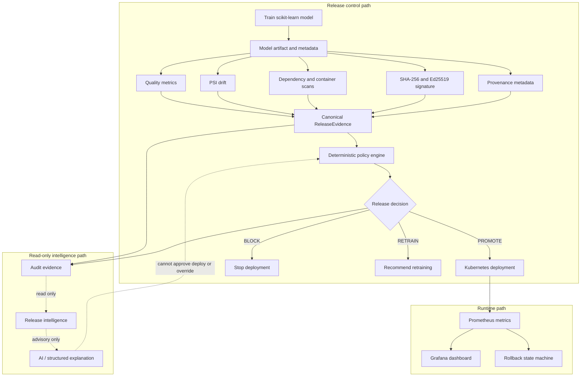
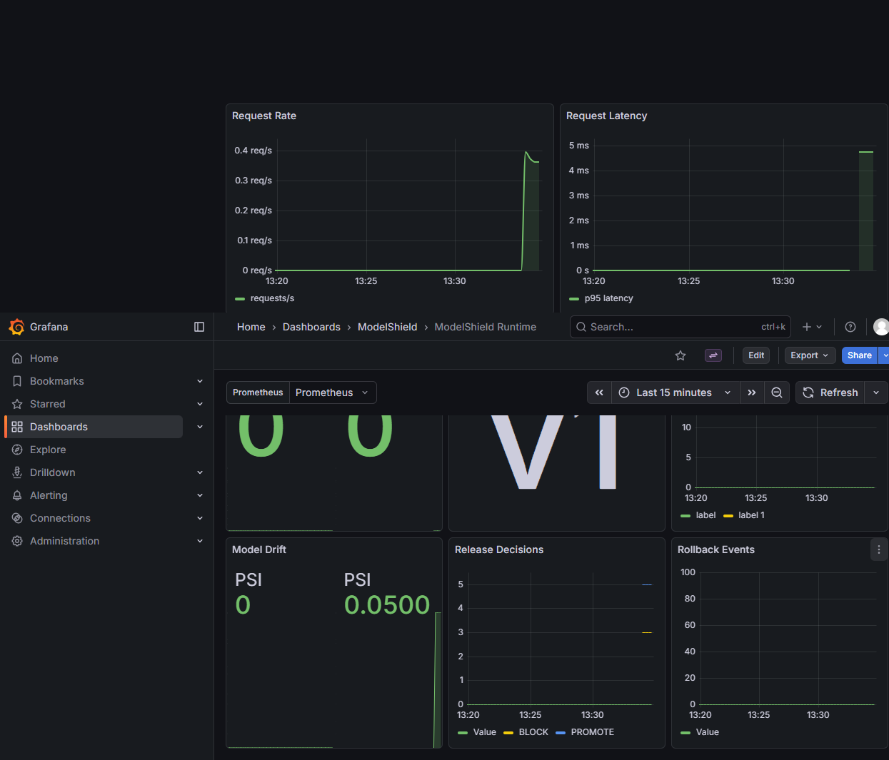

# ModelShield

[](https://github.com/sonalejayash/ModelShield/actions/workflows/ci.yml)
[](https://github.com/sonalejayash/ModelShield/actions/workflows/scorecard.yml)

ModelShield is a secure ML release-control plane for a practical MLOps problem: a model can pass training and still be unsafe to deploy. It demonstrates an evidence-driven workflow that **trains -> verifies -> evaluates -> decides -> audits -> explains**.

**Technologies:** Python, FastAPI, scikit-learn, Docker, Kubernetes, Prometheus, Grafana, Terraform, Trivy, Conftest, OpenSSF Scorecard, MLflow adapter, and optional Ollama transport.

This repository contains no company data or credentials. It is designed to be reproducible locally and understandable as a portfolio project.

## Problem and solution

**Problem:** ML model releases need more than accuracy checks. A release can have acceptable metrics while failing artifact integrity, provenance, security, drift, or runtime safety controls.

**Solution:** ModelShield collects structured release evidence, applies deterministic policy gates, records an audit trail, and provides read-only release intelligence that explains decisions without controlling deployment.

## Product promise

> No ML model reaches deployment unless its quality, security, provenance, and deployment policies pass.

The deterministic policy engine is the final release authority.

The release-intelligence layer is advisory only. It investigates release evidence, correlates historical failures, and explains decisions. It cannot approve, deploy, override policy, or modify access controls.

## What it demonstrates

- Reproducible scikit-learn model training and evaluation.
- Model artifact persistence with SHA-256 digest metadata.
- Ed25519 artifact signing and signature verification.
- Provenance, metadata consistency, and quality threshold checks.
- PSI drift evaluation with a deterministic `RETRAIN` path.
- Dependency and container scan evidence ingestion.
- Deterministic release decisions: `PROMOTE`, `BLOCK`, or `RETRAIN`.
- Complete JSONL audit records with evidence and advisory investigation.
- FastAPI service with `/health`, `/v1/predict`, `/v1/releases/evaluate`, and `/metrics`.
- Prometheus metrics and Grafana dashboard configuration.
- Hardened Docker image and Kubernetes deployment manifests.
- Runtime rollback state machine with cooldown and escalation behavior.
- Terraform Kubernetes module, Conftest policies, SBOM generation, Trivy scan, and OpenSSF Scorecard workflow.
- Read-only Phase 2 intelligence with prompt-injection and malformed-output safeguards.

## Architecture



The dotted intelligence path is read-only and advisory. The deterministic policy engine controls `PROMOTE`, `BLOCK`, and `RETRAIN`.

## Repository layout

| Path | Purpose |
| --- | --- |
| `api/` | FastAPI application and HTTP endpoints |
| `controller/` | Release orchestration and rollback state machine |
| `model/` | Model service and reproducible training workflow |
| `quality/` | Quality metrics and PSI drift evaluation |
| `security/` | Artifact, provenance, and scan verification |
| `policy/` | Policy configuration and deterministic decisions |
| `intelligence/` | Read-only investigation, historical analysis, and Ollama adapter |
| `observability/` | Shared Prometheus metrics |
| `tracking/` | Optional MLflow release tracking adapter |
| `policies/` | YAML thresholds and Rego security policies |
| `deploy/kubernetes/` | Kubernetes Deployment, Service, and NetworkPolicy |
| `deploy/terraform/` | Minimal Terraform Kubernetes module |
| `deploy/grafana/` | Grafana dashboard and Prometheus datasource |
| `scripts/` | Verification, training, release, investigation, history, and demo commands |
| `docs/` | Architecture, threat model, lifecycle, and portfolio evidence |
| `tests/` | Unit, integration, and end-to-end scenario tests |

## Prerequisites

- Python 3.11 or newer
- Docker Desktop with the Linux engine running
- `kubectl` for Kubernetes validation or deployment
- Terraform 1.8 or newer for infrastructure validation
- Optional: Grafana and Prometheus for dashboard rendering
- Optional: Ollama for local model-backed explanations

## Quick start

From the repository root:

```powershell
python -m venv .venv
.\.venv\Scripts\Activate.ps1
python -m pip install --upgrade pip
python -m pip install -e ".[dev]"
python scripts/verify_phase_0.py
python -m pytest -q
```

Run the full interview demo:

```powershell
python scripts/demo.py --model-version demo-v1
```

The demo trains a model, evaluates the release gate, writes an audit record, regenerates the advisory investigation from that audit, and summarizes historical release evidence.

## Golden-path workflow

```powershell
python scripts/train_model.py --output-dir artifacts --model-version v1
python scripts/evaluate_model.py artifacts/model-v1.json
python scripts/release.py --model-version v1
python scripts/investigate_release.py artifacts/audit.jsonl
python scripts/analyze_history.py artifacts/audit.jsonl
```

Deterministic release exit codes:

| Exit code | Meaning |
| --- | --- |
| `0` | `PROMOTE` |
| `1` | `BLOCK` |
| `2` | `RETRAIN`; no autonomous deployment |

Training metadata includes the dataset, random seed, test split, quality metrics, model version, artifact path, SHA-256 digest, signature, public key, source revision, and builder identity. Local runs use `source_revision=local`; GitHub Actions records `GITHUB_SHA`.

## API workflow

Start the service:

```powershell
uvicorn api.app:app --reload
```

Endpoints:

| Endpoint | Purpose |
| --- | --- |
| `GET /health` | Service health |
| `POST /v1/predict` | Model prediction |
| `POST /v1/releases/evaluate` | Deterministic release decision |
| `GET /metrics` | Prometheus exposition format |

## Container and Kubernetes workflow

```powershell
docker build --tag modelshield:local .
docker run --publish 8000:8000 modelshield:local
kubectl apply -f deploy/kubernetes/
```

The image and manifests use a non-root user, health checks, readiness/liveness probes, resource requests and limits, dropped capabilities, a read-only root filesystem, Prometheus scrape annotations, and NetworkPolicy.

## Observability workflow

Import or provision the Grafana dashboard:

- Dashboard: [deploy/grafana/modelshield-dashboard.json](deploy/grafana/modelshield-dashboard.json)
- Prometheus datasource: [deploy/grafana/datasource-prometheus.yml](deploy/grafana/datasource-prometheus.yml)

Prometheus must scrape the ModelShield `/metrics` endpoint before Grafana shows live graphs. The dashboard includes request rate, latency, errors, model version, predictions, drift, release decisions, and rollback events.

Run the complete local monitoring stack:

```powershell
docker compose -f deploy/monitoring/docker-compose.yml up --build --detach
```

- ModelShield API: `http://127.0.0.1:18000`
- Prometheus: `http://127.0.0.1:19090`
- Grafana: `http://127.0.0.1:13000`
- Grafana demo login: `admin` / `modelshield-demo`

Generate traffic with `/v1/predict` and `/v1/releases/evaluate`, then open the provisioned `ModelShield Runtime` dashboard. These credentials are only for the disposable local demonstration.

## Terraform workflow

```powershell
terraform -chdir=deploy/terraform init -backend=false
terraform -chdir=deploy/terraform fmt -check
terraform -chdir=deploy/terraform validate
```

The Terraform module manages the minimal Kubernetes demonstration resources and does not require cloud credentials.

## Policy-as-code workflow

```powershell
docker run --rm --volume "$PWD:/project" --workdir /project openpolicyagent/conftest@sha256:a38ba21668929a00dce2fe6ee43d1312228340bce5fd243f47dd0ce90516e558 test deploy/kubernetes/deployment.yaml --policy policies/rego
```

Conftest validates non-root execution, security contexts, privilege escalation, read-only filesystem, and CPU/memory requests and limits.

## Validation

The CI workflow runs repository verification, Python tests, the full golden-path release workflow, release investigation, historical intelligence, interview demo, Docker build, SBOM generation, Trivy scanning, Terraform validation, and Conftest checks. The Scorecard workflow runs separately on push, schedule, and manual dispatch.

| Check | Purpose |
| --- | --- |
| `python -m pytest -q` | Unit and scenario correctness |
| `python scripts/verify_phase_0.py` | Repository contract validation |
| `python scripts/release.py --model-version v1` | Golden-path release gate |
| `python scripts/investigate_release.py artifacts/audit.jsonl` | Advisory investigation from audit |
| `python scripts/analyze_history.py artifacts/audit.jsonl` | Historical release intelligence |
| `python scripts/demo.py --model-version demo-v1` | Interview demo flow |
| Docker build | Container packaging |
| Trivy | High/critical vulnerability gate |
| SBOM | CycloneDX container inventory |
| Terraform | Infrastructure configuration validation |
| Conftest | Kubernetes policy-as-code validation |
| OpenSSF Scorecard | Repository security posture |

Latest local validation passed with `79` automated tests, Phase 0 verification, Docker build, Conftest policy checks, Terraform validation, and clean-environment demo execution.

## Security controls

| Control | Risk addressed |
| --- | --- |
| Deterministic policy authority | AI or operator recommendation bypass |
| Structured release evidence | Incomplete or ambiguous decision inputs |
| SHA-256 artifact verification | Tampered model artifact |
| Ed25519 signature verification | Unsigned or modified artifact |
| Provenance checks | Missing source or builder identity |
| Metadata consistency check | Recorded metrics disagreeing with actual evaluation |
| Trivy scan gate | Known high/critical vulnerabilities |
| Conftest policies | Unsafe Kubernetes configuration |
| Non-root container and dropped capabilities | Container privilege escalation |
| Read-only root filesystem | Runtime mutation |
| NetworkPolicy | Unnecessary network access |
| Schema-validated intelligence output | Malformed or manipulative AI responses |
| Prompt-injection safeguards | Malicious evidence treated as instructions |
| Optional Ollama timeout/fail-closed handling | AI availability affecting release safety |

Details are in [docs/threat-model.md](docs/threat-model.md).

## Evidence

| Area | Evidence |
| --- | --- |
| CI/CD | [GitHub Actions workflow](.github/workflows/ci.yml) |
| Golden path | [Release demo screenshot](docs/assets/release-demo.png) |
| BLOCK decision | [BLOCK investigation screenshot](docs/assets/block-investigation.png) |
| Validation | [Verification screenshot](docs/assets/verification-summary.png) |
| Grafana | [Live Grafana capture](docs/assets/grafana-live-dashboard.png) and [dashboard JSON](deploy/grafana/modelshield-dashboard.json) |
| Kubernetes | [Deployment manifest](deploy/kubernetes/deployment.yaml) and [Conftest policies](policies/rego/kubernetes_security.rego) |
| Terraform | [Terraform module](deploy/terraform/) |
| Threat model | [AI and release security threat model](docs/threat-model.md) |
| Portfolio appendix | [Portfolio evidence](docs/portfolio-evidence.md) |

## Evidence screenshots

| Golden-path release demo | BLOCK release intelligence |
| --- | --- |
|  |  |

| Verification and security checks | Live Grafana dashboard |
| --- | --- |
|  |  |

## Phase 2 BLOCK intelligence example

This output was generated from real ModelShield audit records using the release controller and historical analyzer:

```text
Release: demo-v1
Policy Decision: BLOCK

Current Evidence
  Critical vulnerabilities: 1
  Quality: PASS
  Drift: PASS
  Signature: VALID
  Provenance: VALID

Historical Correlation
  Previous security failures: 2
  Quality trend: STABLE
  Drift trend: INCREASING

Investigation
  Security gate blocked the release.
  This is the third release with a critical vulnerability.

AI Authority
  ADVISORY ONLY

Final Decision
  BLOCK
```

## Portfolio demo

Run the evidence tour:

```powershell
python scripts/demo.py --model-version demo-v1
```

Suggested interview flow:

1. Run a healthy release and show `PROMOTE`.
2. Explain that security failures, invalid signatures, invalid provenance, metadata mismatch, and critical vulnerabilities produce `BLOCK`.
3. Show severe drift produces `RETRAIN` without autonomous deployment.
4. Show rollback tests for runtime degradation and recovery.
5. Open the audit record and show evidence, reasons, and investigation.
6. Run release intelligence and historical analysis.
7. Point out that AI is advisory only and cannot override the deterministic policy engine.

The entire demo works without cloud credentials.

## Limitations

- Model quality depends on representative evaluation data.
- Runtime accuracy requires production ground-truth labels.
- PSI indicates distribution shift; it does not by itself prove model degradation.
- The demonstration uses a small scikit-learn model and built-in dataset.
- Ollama is optional and is not required for release safety.
- `RETRAIN` is advisory and does not autonomously retrain or deploy a model.
- Rollback requires a previous approved release to be available.
- Grafana shows live data only after Prometheus scrapes `/metrics` and traffic is generated.
- ModelShield is a portfolio/reference implementation, not a claim of production certification.

## Production evolution

If this system moved toward production, the next steps would be OCI registry integration, external secret management, signed provenance attestations, managed Kubernetes, progressive delivery, Alertmanager/on-call workflows, SLO/error-budget release gates, centralized logging, and real production ground-truth feedback loops.

## Completed milestones

- [x] Phase 0: Foundation, architecture, lifecycle, threat model, and repository verifier
- [x] Phase 1: V1 golden path, policy engine, model workflow, audit records, API, Docker, Kubernetes, metrics, rollback, and CI
- [x] Phase 1.5: MLflow adapter, Terraform, Grafana, SBOM, Conftest, Trivy, and OpenSSF Scorecard
- [x] Phase 2: Read-only release intelligence, historical analysis, optional Ollama transport, AI safety tests, and interview demo
- [x] Final portfolio polish: README cleanup, screenshots, evidence appendix, feature matrix, and verification summary

## Development rule

Every phase must be implemented, tested, verified, documented, and published before the next phase begins. The README must be updated whenever a phase is completed. No production capability is claimed without executable evidence.
