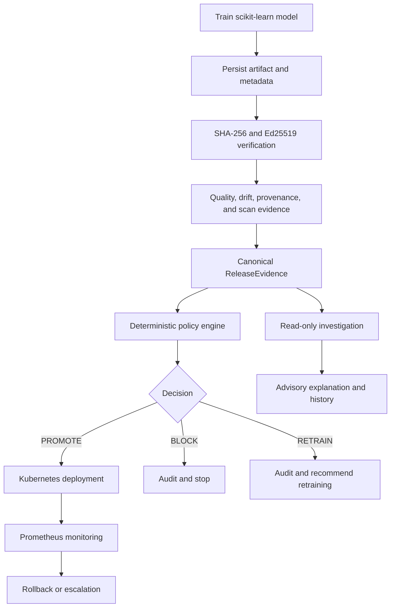

# ModelShield

[](https://github.com/sonalejayash/ModelShield/actions/workflows/ci.yml)
[](https://github.com/sonalejayash/ModelShield/actions/workflows/scorecard.yml)

ModelShield is a policy-driven ML release control plane. It evaluates model quality, data drift, artifact integrity, provenance, and supply-chain security before a model can be promoted to Kubernetes. It also exposes runtime metrics and supports controlled rollback.

## Product promise

> No ML model reaches deployment unless its quality, security, provenance, and deployment policies pass.

The deterministic policy engine is the final authority. Future AI release intelligence may investigate evidence and explain decisions, but it will never approve, deploy, override policy, or change access controls.

## Project status

| Stage | Status | Evidence |
|---|---|---|
| Phase 0: foundation | Complete | Repository verifier, architecture, lifecycle, and threat model |
| Phase 1: V1 golden path | Complete | Reproducible release command and `71` passing tests |
| Phase 1.5: platform improvements | Complete | MLflow, Terraform, Grafana, SBOM, Conftest, and Scorecard integrations |
| Phase 2: release intelligence | Complete | Read-only investigation, historical intelligence, optional Ollama transport, and interview demo |

## Feature matrix

| Area | Capability | Status |
|---|---|---|
| Model lifecycle | Reproducible scikit-learn training and evaluation | Complete |
| Quality | Accuracy, precision, recall, F1, and policy thresholds | Complete |
| Drift | PSI drift evaluation and `RETRAIN` decision path | Complete |
| Integrity | SHA-256 artifact verification | Complete |
| Signing | Ed25519 artifact signatures | Complete |
| Provenance | Source revision and builder identity checks | Complete |
| Security | Dependency/container scan evidence and Trivy CI gate | Complete |
| Policy | Deterministic `PROMOTE`, `BLOCK`, and `RETRAIN` engine | Complete |
| Audit | JSONL decision records with evidence and investigation | Complete |
| Runtime | FastAPI service, Prometheus metrics, Docker, Kubernetes | Complete |
| Rollback | Runtime state machine with cooldown and escalation | Complete |
| Platform | Terraform, Grafana, SBOM, Conftest, Scorecard | Complete |
| Intelligence | Read-only explanations, history analysis, optional Ollama | Complete |

## Golden path

```text
Train model
  -> persist artifact and metadata
  -> calculate and verify SHA-256
  -> verify Ed25519 signature and provenance
  -> evaluate quality and PSI drift
  -> consume dependency and container scan results
  -> build ReleaseEvidence
  -> apply deterministic policy
  -> PROMOTE, BLOCK, or RETRAIN
  -> append complete audit record
```

Run it with one cross-platform command:

```bash
python scripts/release.py --model-version v1
```

Exit codes are deterministic:

- `0`: `PROMOTE`
- `1`: `BLOCK`
- `2`: `RETRAIN` recommended; never deployed automatically

The command uses the built-in scikit-learn breast-cancer dataset, a seeded train/test split, a scaled logistic-regression pipeline, generated clean scan reports, and the configured model policy. It writes the model artifact, signed metadata, and JSONL audit record under `artifacts/`.

## Implemented capabilities

### Model workflow

- Fixed dataset and reproducible loading
- Seeded train/test split
- scikit-learn scaled logistic-regression model
- Joblib artifact persistence
- Accuracy, precision, recall, and F1 evaluation
- Model version and provenance metadata
- SHA-256 artifact digest
- Ed25519 signature and public key metadata
- Actual-artifact re-evaluation
- Metadata-versus-actual metric consistency checks

### Release controls

- Canonical `ReleaseEvidence` contract
- Version-controlled YAML policy thresholds
- Security precedence over quality and drift decisions
- `PROMOTE`, `BLOCK`, and `RETRAIN` outcomes
- Complete append-only JSONL audit records
- Read-only investigation included in audit records
- Evidence references for scan reports
- Invalid signature, provenance, hash, and metadata rejection

### Runtime platform

- FastAPI health, prediction, release-evaluation, and metrics endpoints
- Prometheus metrics for predictions, latency, errors, drift, release decisions, model version, and rollback events
- Non-root Docker image
- Kubernetes Deployment, Service, and NetworkPolicy
- Resource requests and limits
- Read-only root filesystem and dropped capabilities
- Runtime rollback state machine with cooldown and escalation

### Platform security

- Optional MLflow release tracking adapter
- Terraform Kubernetes module with locked provider selection
- Grafana operational dashboard
- CycloneDX container SBOM generation in CI
- Conftest Kubernetes security policies
- OpenSSF Scorecard SARIF workflow
- Trivy high/critical container vulnerability gate

## Local setup

Requirements: Python 3.11+, Docker, and optionally Kubernetes/Terraform for deployment validation.

```bash
python -m venv .venv
python -m pip install --upgrade pip
python -m pip install -e ".[dev]"
python scripts/verify_phase_0.py
python -m pytest -q
```

## Model commands

```bash
python scripts/train_model.py --output-dir artifacts --model-version v1
python scripts/evaluate_model.py artifacts/model-v1.json
python scripts/release.py --model-version v1
python scripts/investigate_release.py artifacts/audit.jsonl
python scripts/analyze_history.py artifacts/audit.jsonl
python scripts/demo.py --model-version demo-v1
```

## Interview demo

Run this command to demonstrate the project end to end:

```bash
python scripts/demo.py --model-version demo-v1
```

The demo trains a model, evaluates the release gate, writes an audit record, regenerates the advisory investigation from that audit, and summarizes historical release evidence. The AI/intelligence layer remains read-only and cannot change the deterministic policy decision.

Expected result:

```text
Policy: PROMOTE
Release: PROMOTED
advisory_only: true
latest_decision: PROMOTE
Demo complete
```

See [docs/portfolio-evidence.md](docs/portfolio-evidence.md) for the latest captured terminal evidence.

Training metadata includes the dataset, random seed, test split, quality metrics, model version, artifact path, SHA-256 digest, signature, public key, source revision, and builder identity. Local runs use `source_revision=local`; GitHub Actions records `GITHUB_SHA`.

## API

Start the service:

```bash
uvicorn api.app:app --reload
```

Endpoints:

- `GET /health`: service health
- `POST /v1/predict`: model prediction
- `POST /v1/releases/evaluate`: deterministic release decision
- `GET /metrics`: Prometheus exposition format

## Container and Kubernetes

```bash
docker build --tag modelshield:local .
docker run --publish 8000:8000 modelshield:local
kubectl apply -f deploy/kubernetes/
```

The container runs as a non-root user and includes a health check. Kubernetes adds two replicas, readiness and liveness probes, resource limits, a restrictive NetworkPolicy, a read-only filesystem, dropped capabilities, and Prometheus scrape annotations.

## Platform validation

Terraform validation:

```bash
cd deploy/terraform
terraform init -backend=false
terraform fmt -check
terraform validate
```

Conftest validation:

```bash
conftest test deploy/kubernetes/deployment.yaml --policy policies/rego
```

The CI workflow runs Python tests, repository verification, Docker build, SBOM generation, Trivy scanning, Terraform validation, and Conftest policy checks. The Scorecard workflow runs separately on pushes, weekly, and manually.

Final local verification commands:

```bash
python -m pytest -q
python scripts/verify_phase_0.py
docker build --tag modelshield:ci .
docker run --rm --volume "$PWD:/project" --workdir /project openpolicyagent/conftest@sha256:a38ba21668929a00dce2fe6ee43d1312228340bce5fd243f47dd0ce90516e558 test deploy/kubernetes/deployment.yaml --policy policies/rego
```

Clean-environment demonstration:

```bash
python -m venv .venv
python -m pip install --upgrade pip
python -m pip install -e ".[dev]"
python scripts/demo.py --model-version demo-v1
```

## Architecture



## Repository map

- `model/`: model service and reproducible training workflow
- `quality/`: quality metrics and PSI drift evaluation
- `security/`: artifact, provenance, and scan verification
- `policy/`: policy configuration and deterministic decisions
- `controller/`: release orchestration and rollback state machine
- `api/`: FastAPI application
- `observability/`: shared Prometheus metrics
- `tracking/`: optional MLflow adapter
- `policies/`: YAML thresholds and Rego security policies
- `deploy/kubernetes/`: Kubernetes manifests
- `deploy/terraform/`: minimal Terraform Kubernetes module
- `deploy/grafana/`: operational dashboard JSON
- `scripts/`: verification, training, evaluation, and release commands
- `tests/`: unit, integration, and scenario tests

## Roadmap

Phase 2 is complete with a read-only investigator contract integrated into audit records and covered by end-to-end release scenarios. `scripts/investigate_release.py` can regenerate an advisory investigation report from an existing audit log, and `scripts/analyze_history.py` summarizes historical release decisions, recurring reasons, quality trends, and drift trends. Its output is structured, evidence-cited, schema-validated, and advisory, with missing and contradictory evidence flagged explicitly. An optional local Ollama transport is timeout-bound and receives structured evidence only. The intelligence layer must match the deterministic decision, has no unrestricted shell or Kubernetes access, and is not part of the final release authority.
