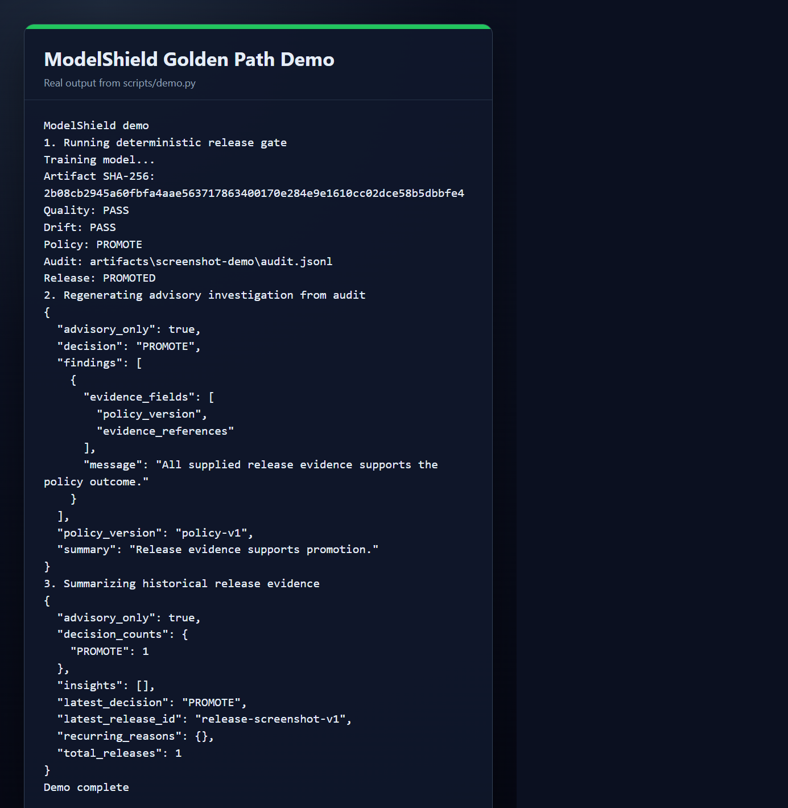
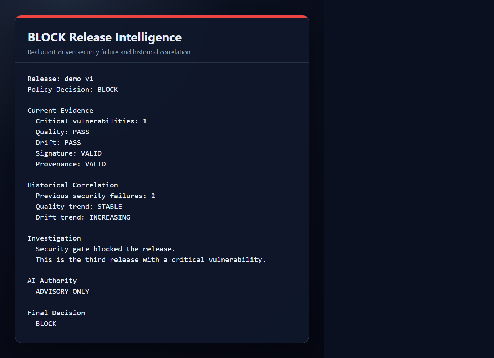
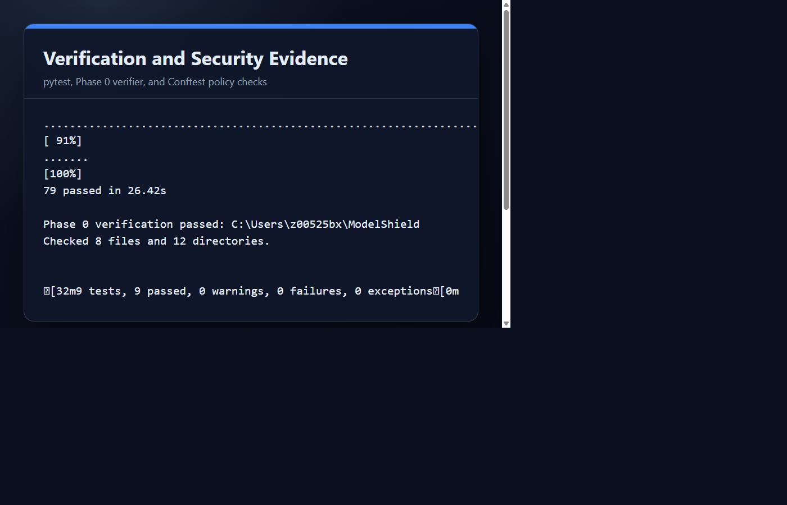
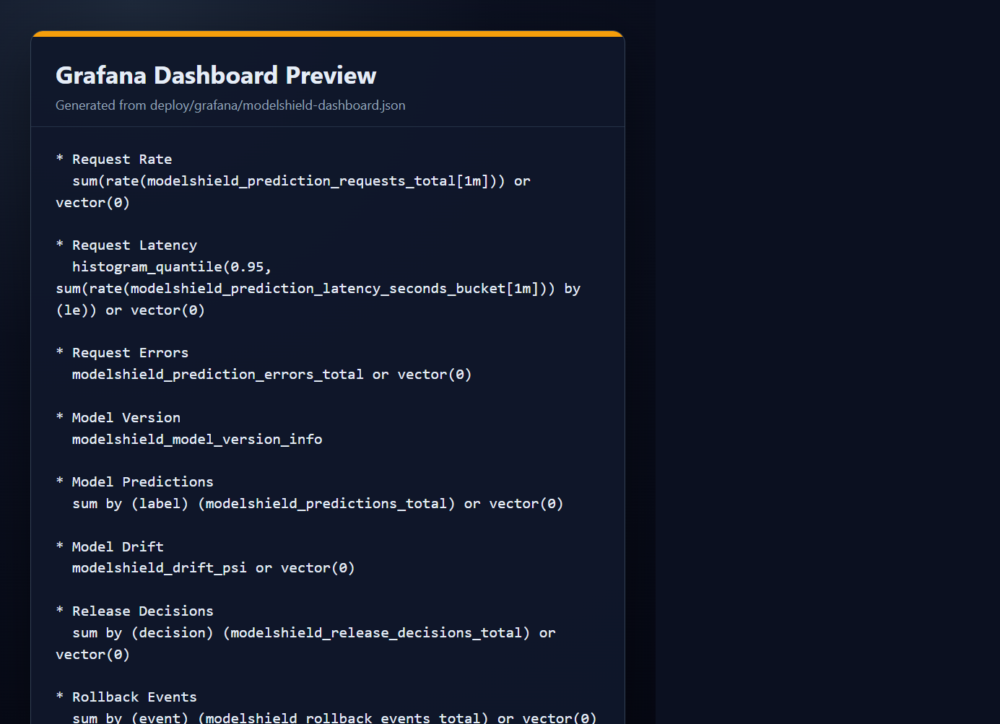

# Portfolio Evidence

This document captures the current verification evidence for ModelShield. The README remains the primary project guide; this file is a concise evidence appendix for interview review.

## Final Local Demo

Command:

```bash
python scripts/demo.py --model-version portfolio-v1 --output-dir artifacts/portfolio-demo
```

Captured output:

```text
ModelShield demo
1. Running deterministic release gate
Training model...
Artifact SHA-256: 2b08cb2945a60fbfa4aae563717863400170e284e9e1610cc02dce58b5dbbfe4
Quality: PASS
Drift: PASS
Policy: PROMOTE
Audit: artifacts\portfolio-demo\audit.jsonl
Release: PROMOTED
2. Regenerating advisory investigation from audit
{
  "advisory_only": true,
  "decision": "PROMOTE",
  "findings": [
    {
      "evidence_fields": [
        "policy_version",
        "evidence_references"
      ],
      "message": "All supplied release evidence supports the policy outcome."
    }
  ],
  "policy_version": "policy-v1",
  "summary": "Release evidence supports promotion."
}
3. Summarizing historical release evidence
{
  "advisory_only": true,
  "decision_counts": {
    "PROMOTE": 1
  },
  "insights": [],
  "latest_decision": "PROMOTE",
  "latest_release_id": "release-portfolio-v1",
  "recurring_reasons": {},
  "total_releases": 1
}
Demo complete
```

## Verification Checklist

- Python regression tests: `77 passed`
- Repository verifier: passing
- Docker image build: verified in CI and local validation during development
- Trivy high/critical container scan: enforced in CI
- Conftest Kubernetes policy checks: enforced in CI and validated locally
- Terraform validation: enforced in CI and validated with the official Terraform container
- SBOM generation: CycloneDX artifact generated in CI
- OpenSSF Scorecard: dedicated workflow configured
- Clean-environment demo: temporary virtual environment install and `scripts/demo.py` passed

## Clean-Environment Demonstration

Executed in a temporary virtual environment outside the repository:

```text
Successfully installed modelshield-0.1.0
ModelShield demo
1. Running deterministic release gate
Policy: PROMOTE
Release: PROMOTED
2. Regenerating advisory investigation from audit
"advisory_only": true
3. Summarizing historical release evidence
"latest_decision": "PROMOTE"
Demo complete
```

## Portfolio Scenario Evidence

| Evidence | Screenshot |
|---|---|
| Golden-path release demo |  |
| BLOCK release intelligence |  |
| Verification and security checks |  |
| Grafana dashboard preview |  |

### PROMOTE

```text
Policy: PROMOTE
Release: PROMOTED
Audit: artifacts\portfolio-demo\audit.jsonl
```

### BLOCK

```text
Policy Decision: BLOCK
Critical vulnerabilities: 1
Security gate blocked the release.
Final Decision: BLOCK
```

### RETRAIN

Executable evidence: `tests/scenarios/test_release_scenarios.py::test_severe_drift_requests_retraining`.

```text
Severe pre-release drift -> RETRAIN
Model is not promoted automatically.
```

### ROLLBACK

Executable evidence: `tests/unit/test_rollback.py::test_two_failures_confirm_failure_and_successful_rollback`.

```text
HEALTHY -> DEGRADED -> FAILURE_CONFIRMED -> ROLLBACK -> RECOVERED
```

### AI Investigation

```text
advisory_only: true
decision: PROMOTE
summary: Release evidence supports promotion.
```

### Historical Analysis

```text
decision_counts: { PROMOTE: 1 }
latest_decision: PROMOTE
total_releases: 1
```

### Grafana

Evidence: [deploy/grafana/modelshield-dashboard.json](../deploy/grafana/modelshield-dashboard.json) parses successfully and contains panels for request rate, latency, errors, model version, predictions, drift, release decisions, and rollback events.

### Kubernetes

Evidence: [deploy/kubernetes/deployment.yaml](../deploy/kubernetes/deployment.yaml) is validated by Conftest policies covering non-root execution, read-only filesystem, dropped privilege escalation, and resource requests/limits.

### CI

Evidence: [.github/workflows/ci.yml](../.github/workflows/ci.yml) runs repository verification, tests, the golden-path release workflow, investigation, historical analysis, demo, Docker build, SBOM generation, Trivy scanning, Terraform validation, and Conftest checks.

### Security Scanning

Evidence: Trivy high/critical container scanning is enforced in CI, and OpenSSF Scorecard runs through [.github/workflows/scorecard.yml](../.github/workflows/scorecard.yml).

## Interview Talking Points

- Deterministic policy remains the release authority.
- AI/intelligence is read-only, schema-validated, and advisory.
- Audit records contain the evidence needed to reproduce decisions.
- Security failures take precedence over drift and lower-priority conditions.
- The demo proves training, verification, policy, audit, investigation, and history analysis in one command.